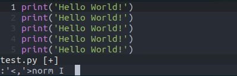
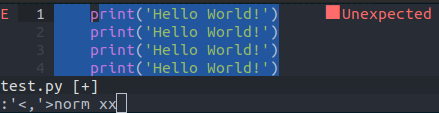

@[TOC](NVIM常用操作技巧)

# Vim如何批量缩进指定个数空格

通常情况下，在选中需要缩进的文本后，按下`>`或`<`进行缩进，但是这种缩进通常会被设置成向右/左缩进一个Tab，如果我们想要缩进指定个数的空格如何操作呢？这种操作经常出现在编辑多种编程语言的时候，编程语言之间缩进空格数不一样的情况下进行操作。

## 批量右移n个空格
按下`shift+v`进入行可视模式，选中需要操作的区域，然后按下`:`，这时候vim的左下角命令行出现`'<,'>`，在后面紧接着输入`norm I<space>`，需要注意的是`<space>`表示按下空格，需要缩进几个空格就输入几个空格。

## 批量左移n个空格

按下`shift+v`进入行可视模式，选中需要操作的区域，然后按下`:`，这时候vim的左下角命令行出现`'<,'>`，在后面紧接着输入`norm xx`，需要注意的是输入几个`x`就向左边移动几个空格。

